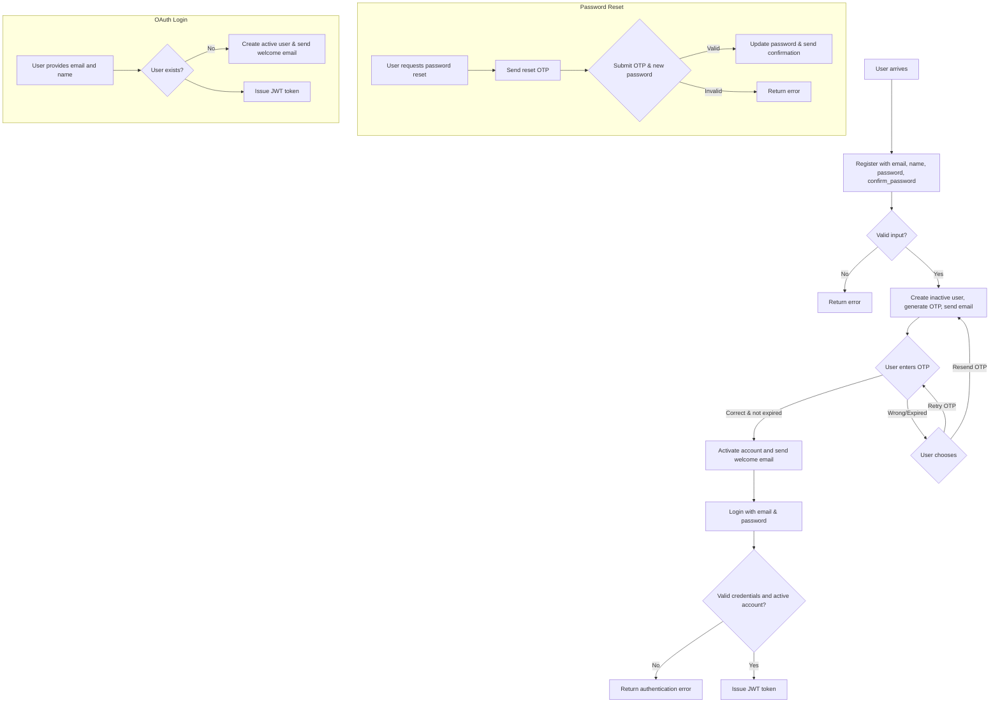

# Scrapiz API Documentation

## Overview

This document provides a clear description of the Scrapiz backend APIs in English. It explains the purpose of each endpoint, request and response formats, error cases, and the user workflow.

---

## User Workflow

Below is the simplified flow for a user journey:



---

## Endpoints

### 1. Register User

* **Endpoint:** `POST /api/register`
* **Purpose:** Creates an inactive user and sends an OTP to their email.
* **Request Body:**

```json
{"email": "user@example.com", "name": "User Name", "password": "pass", "confirm_password": "pass"}
```

* **Response:**

```json
{"message": "User created successfully. OTP sent to your email."}
```

### 2. Verify OTP

* **Endpoint:** `PUT /api/register`
* **Purpose:** Activates a user after OTP verification.
* **Request Body:**

```json
{"email": "user@example.com", "otp": "1234"}
```

* **Response:**

```json
{"message": "User verified successfully"}
```

### 3. Resend OTP

* **Endpoint:** `POST /api/resendotp`
* **Purpose:** Sends a new OTP if the user is still inactive.
* **Request Body:**

```json
{"email": "user@example.com"}
```

* **Response:**

```json
{"message": "OTP resent successfully."}
```

### 4. Login

* **Endpoint:** `POST /api/login`
* **Purpose:** Authenticates the user and returns a JWT token.
* **Request Body:**

```json
{"email": "user@example.com", "password": "securepassword"}
```

* **Response:**

```json
{"jwt": "<token_string>"}
```

### 5. Logout

* **Endpoint:** `POST /api/logout`
* **Purpose:** Logs the user out by deleting the JWT cookie.
* **Response:**

```json
{"message": "Logged out successfully"}
```

### 6. Password Reset Request

* **Endpoint:** `POST /api/password-reset-request`
* **Purpose:** Sends an OTP for password reset.
* **Request Body:**

```json
{"email": "user@example.com"}
```

* **Response:**

```json
{"message": "OTP sent to your email."}
```

### 7. Password Reset

* **Endpoint:** `POST /api/password-reset`
* **Purpose:** Verifies OTP and updates the password.
* **Request Body:**

```json
{"email": "user@example.com", "otp": "1234", "new_password": "newpass"}
```

* **Response:**

```json
{"message": "Password reset successful."}
```

### 8. OAuth Login

* **Endpoint:** `POST /api/oauth-login`
* **Purpose:** Logs in or creates a user using email and name, returns a JWT.
* **Request Body:**

```json
{"email": "user@example.com", "name": "User Name"}
```

* **Response:**

```json
{"jwt": "<token_string>"}
```

---

## Email Templates

Located in `api/templates/email/`:

* `registeration_otp.html`
* `welcome.html`
* `otp_resend.html`
* `password_reset.html`
* `password_reset_successful.html` (fix naming to match the view)

---

## Example cURL Commands

```bash
# Register
curl -X POST http://localhost:8000/api/register \
  -H "Content-Type: application/json" \
  -d '{"email":"foo@bar.com","name":"Foo","password":"pwd","confirm_password":"pwd"}'

# Verify OTP
curl -X PUT http://localhost:8000/api/register \
  -H "Content-Type: application/json" \
  -d '{"email":"foo@bar.com","otp":"1234"}'

# Login
curl -X POST http://localhost:8000/api/login \
  -H "Content-Type: application/json" \
  -d '{"email":"foo@bar.com","password":"pwd"}'
```

For any querries contact the developer 
- Fareed Sayed 
- `fareedsayed95@gmail.com`
- `+919987580370`