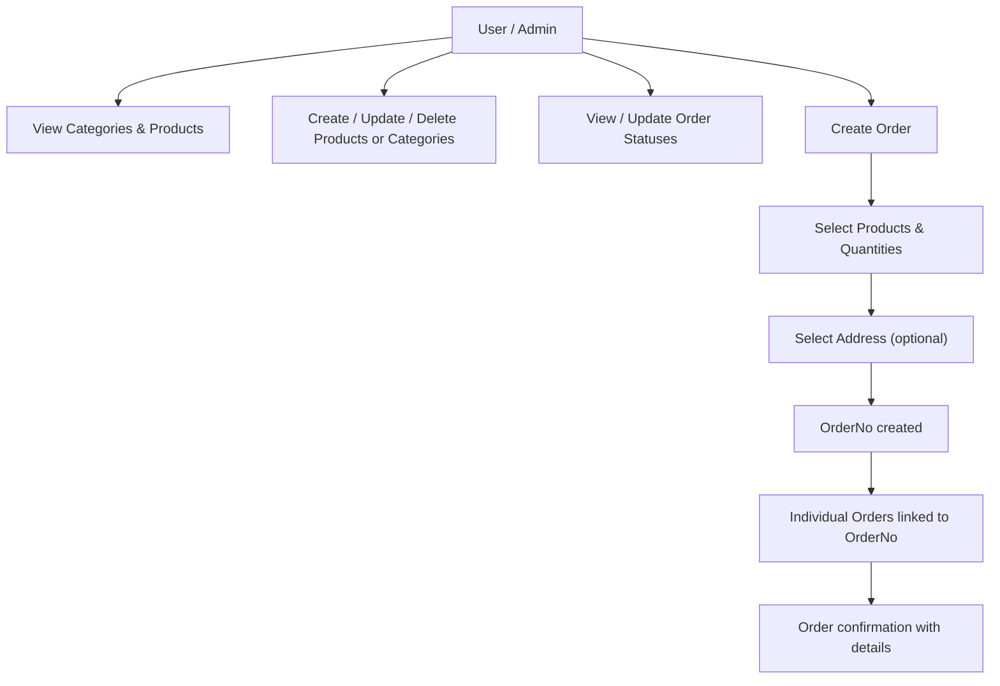

# Inventory Management API Documentation

## Overview

The Inventory Management module in Scrapiz allows managing products, categories, order statuses, and user orders. This module provides endpoints for CRUD operations as well as order creation with address assignment.

It is designed for secure access with a frontend secret key and JWT-based user authentication.

---

## Inventory Workflow



---

## Endpoints

### 1. Categories

* **Endpoint:** `/api/inventory/categories/`
* **Methods:** `GET`, `POST`, `PUT`, `PATCH`, `DELETE`
* **Purpose:** Manage product categories.

**Request Body Example (POST / PATCH):**

```json
{"name": "Scrap Metal"}
```

**Response Example (GET):**

```json
[
  {
    "id": 1,
    "name": "Scrap Metal",
    "products": [
        {"id": 1, "name": "Iron", "max_rate": 35, "min_rate": 30, "unit": "per-kg", "description": "good", "category": 1},
        {"id": 2, "name": "Tin", "max_rate": 30, "min_rate": 25, "unit": "per-kg", "description": "good tin cans", "category": 1}
    ]
  }
]
```

---

### 2. Products

* **Endpoint:** `/api/inventory/products/`
* **Methods:** `GET`, `POST`, `PUT`, `PATCH`, `DELETE`
* **Purpose:** Manage products.

**Request Body Example:**

```json
{
  "name": "Aluminum",
  "max_rate": 50,
  "min_rate": 45,
  "unit": "per-kg",
  "description": "Lightweight metal",
  "category": 1
}
```

**Response Example:**

```json
{
  "id": 3,
  "name": "Aluminum",
  "max_rate": 50,
  "min_rate": 45,
  "unit": "per-kg",
  "description": "Lightweight metal",
  "category": 1
}
```

---

### 3. Statuses

* **Endpoint:** `/api/inventory/statuses/`
* **Methods:** `GET`, `POST`, `PUT`, `PATCH`, `DELETE`
* **Purpose:** Manage order statuses.

**Request Body Example:**

```json
{"name": "Pending"}
```

**Response Example:**

```json
{
  "id": 1,
  "name": "Pending"
}
```

---

### 4. Orders (OrderNo & Order)

#### a) OrderNo

* **Endpoint:** `/api/inventory/ordernos/`
* **Methods:** `GET`, `POST`, `PUT`, `PATCH`, `DELETE`
* **Purpose:** Represents an order created by a user, containing multiple items.
* **Nested Fields:** Includes `orders` (products in the order), `status`, `user`, and `address`.

**Response Example:**

```json
[
  {
    "id": 7,
    "order_number": "F4pw0DIi",
    "user": "fareedsayed95@gmail.com",
    "created_at": "2025-08-20T06:54:23.093086+05:30",
    "status": {"id": 1, "name": "Pending"},
    "address": 1,
    "orders": [
        {"id": 13, "product": {"id": 1, "name": "Iron"}, "quantity": "2.00"},
        {"id": 14, "product": {"id": 2, "name": "Tin"}, "quantity": "3.00"}
    ]
  }
]
```

#### b) Individual Orders

* **Endpoint:** `/api/inventory/orders/`
* **Methods:** `GET`, `POST`, `PUT`, `PATCH`, `DELETE`
* **Purpose:** Manage individual items within an order.

**Response Example:**

```json
{
  "id": 13,
  "order_no": 7,
  "product": {"id": 1, "name": "Iron", "unit": "per-kg"},
  "quantity": "2.00"
}
```

---

### 5. Create Order (Custom API)

* **Endpoint:** `/api/inventory/create-order/`
* **Method:** `POST`
* **Purpose:** Allows a user to create an order with multiple products and an optional address.
* **Headers:**

```json
x-auth-app: FRONTEND_SECRET_KEY
Authorization: JWT_TOKEN
```

* **Request Body Example:**

```json
{
  "items": [
    {"product_id": 1, "quantity": 2},
    {"product_id": 2, "quantity": 3}
  ],
  "address_id": 1
}
```

* **Response Example:**

```json
{
  "message": "Order created successfully",
  "order_no": "F4pw0DIi",
  "email": "fareedsayed95@gmail.com",
  "address": "Home, MG Road, Chembur East, Mumbai",
  "orders": [
    {"id": 13, "product": "Iron", "quantity": 2, "unit": "per-kg"},
    {"id": 14, "product": "Tin", "quantity": 3, "unit": "per-kg"}
  ]
}
```

---

## Security

* All API requests require the `x-auth-app` header with the frontend secret key.
* User-specific endpoints require JWT authentication in the `Authorization` header.

---

## Contact

For any queries, you can reach out to the developer:

* **Name:** Fareed Sayed
* **Email:** `fareedsayed95@gmail.com`
* **Phone:** `+91 9987580370`
