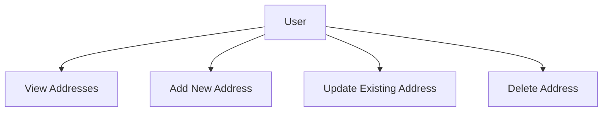

# User Data API Documentation

## Overview

The User Data module in Scrapiz handles user-specific information such as addresses.
It provides secure CRUD operations for managing user addresses with JWT-based authentication and frontend secret key verification.

---

## Address Workflow



---

## Endpoints

### 1. Get All Addresses

* **Endpoint:** `/api/user/address/`
* **Method:** `GET`
* **Purpose:** Retrieve all addresses of the logged-in user.
* **Headers:**

```json
x-auth-app: FRONTEND_SECRET_KEY
Authorization: JWT_TOKEN
```

* **Response Example:**

```json
[
  {
    "id": 1,
    "name": "Home",
    "phone_number": "9876543210",
    "room_number": "101",
    "street": "MG Road",
    "area": "Chembur East",
    "city": "Mumbai",
    "state": "Maharashtra",
    "country": "India",
    "pincode": 400071,
    "delivery_suggestion": "Ring the bell twice",
    "user": 2
  }
]
```

---

### 2. Create Address

* **Endpoint:** `/api/user/address/`
* **Method:** `POST`
* **Purpose:** Add a new address for the logged-in user.
* **Headers:**

```json
x-auth-app: FRONTEND_SECRET_KEY
Authorization: JWT_TOKEN
```

* **Request Body Example:**

```json
{
  "name": "Office",
  "phone_number": "9876543210",
  "room_number": "501",
  "street": "Main Street",
  "area": "Andheri West",
  "city": "Mumbai",
  "state": "Maharashtra",
  "country": "India",
  "pincode": 400058,
  "delivery_suggestion": "Reception desk"
}
```

* **Response Example:**

```json
{
  "id": 2,
  "name": "Office",
  "phone_number": "9876543210",
  "room_number": "501",
  "street": "Main Street",
  "area": "Andheri West",
  "city": "Mumbai",
  "state": "Maharashtra",
  "country": "India",
  "pincode": 400058,
  "delivery_suggestion": "Reception desk",
  "user": 2
}
```

---

### 3. Update Address

* **Endpoint:** `/api/user/address/<pk>/`
* **Method:** `PUT`
* **Purpose:** Update an existing address owned by the logged-in user.
* **Headers:**

```json
x-auth-app: FRONTEND_SECRET_KEY
Authorization: JWT_TOKEN
```

* **Request Body Example:** (partial update allowed)

```json
{
  "room_number": "502",
  "delivery_suggestion": "Call on arrival"
}
```

* **Response Example:**

```json
{
  "id": 2,
  "name": "Office",
  "phone_number": "9876543210",
  "room_number": "502",
  "street": "Main Street",
  "area": "Andheri West",
  "city": "Mumbai",
  "state": "Maharashtra",
  "country": "India",
  "pincode": 400058,
  "delivery_suggestion": "Call on arrival",
  "user": 2
}
```

---

### 4. Delete Address

* **Endpoint:** `/api/user/address/<pk>/`
* **Method:** `DELETE`
* **Purpose:** Delete an address owned by the logged-in user.
* **Headers:**

```json
x-auth-app: FRONTEND_SECRET_KEY
Authorization: JWT_TOKEN
```

* **Response Example:**

```json
{
  "message": "Address deleted successfully"
}
```

---

## Security

* All requests require the `x-auth-app` header with the frontend secret key.
* JWT token in the `Authorization` header is required to identify the logged-in user.
* Users can only manage their own addresses.

---

## Contact

For any queries, you can reach out to the developer:

* **Name:** Fareed Sayed
* **Email:** `fareedsayed95@gmail.com`
* **Phone:** `+91 9987580370`
